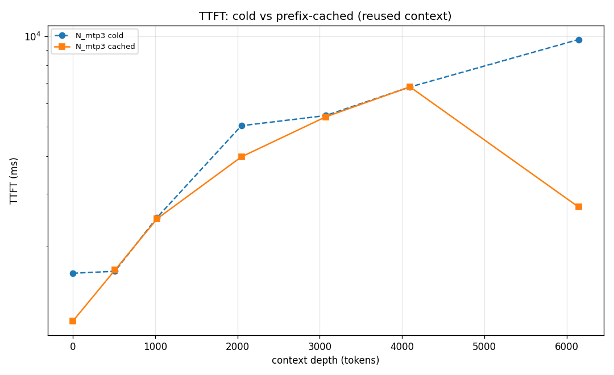
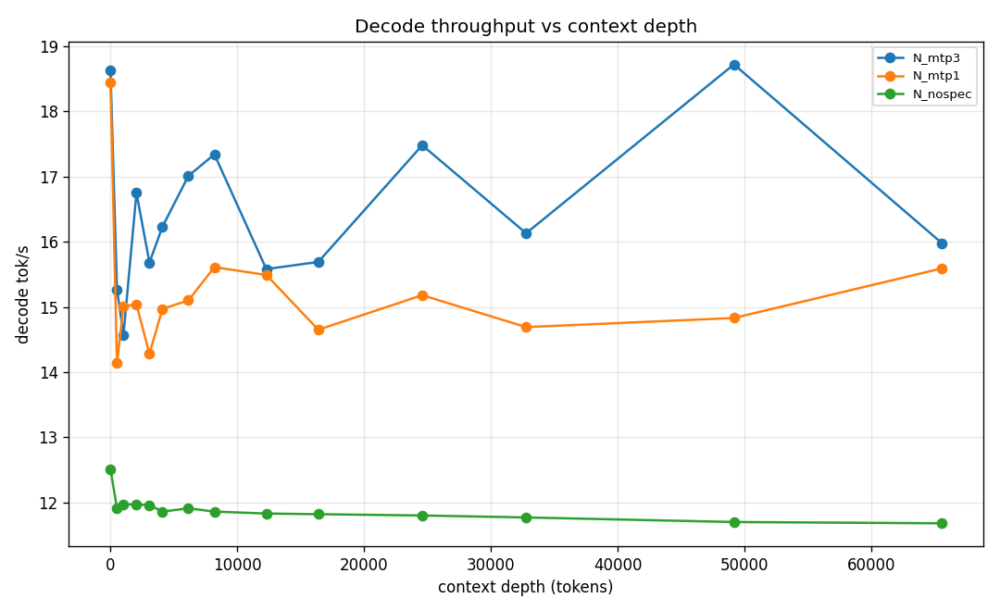
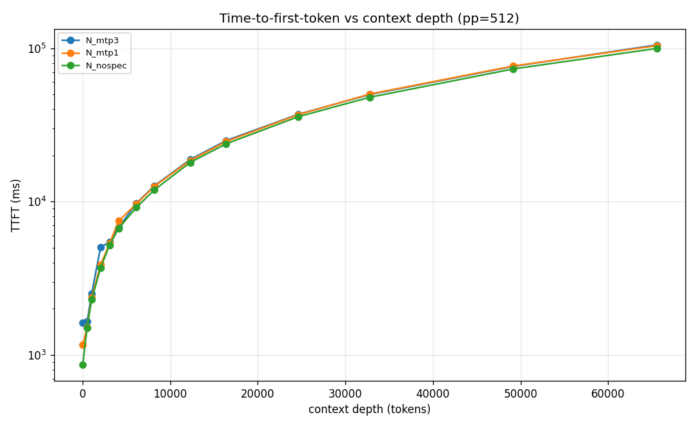
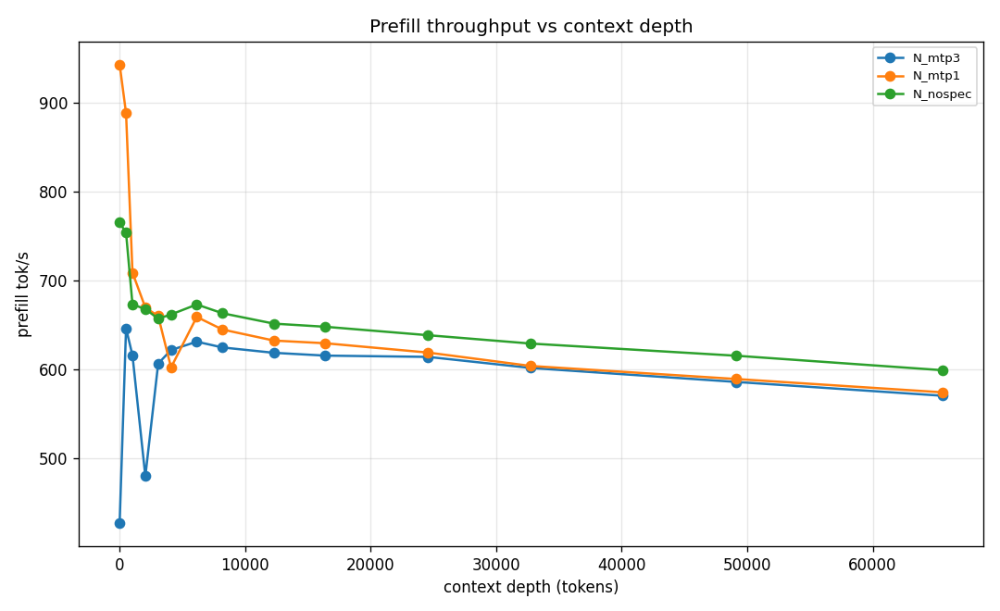
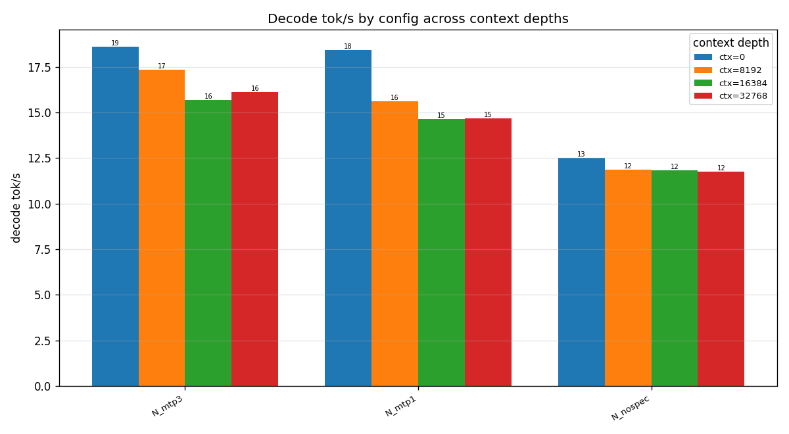
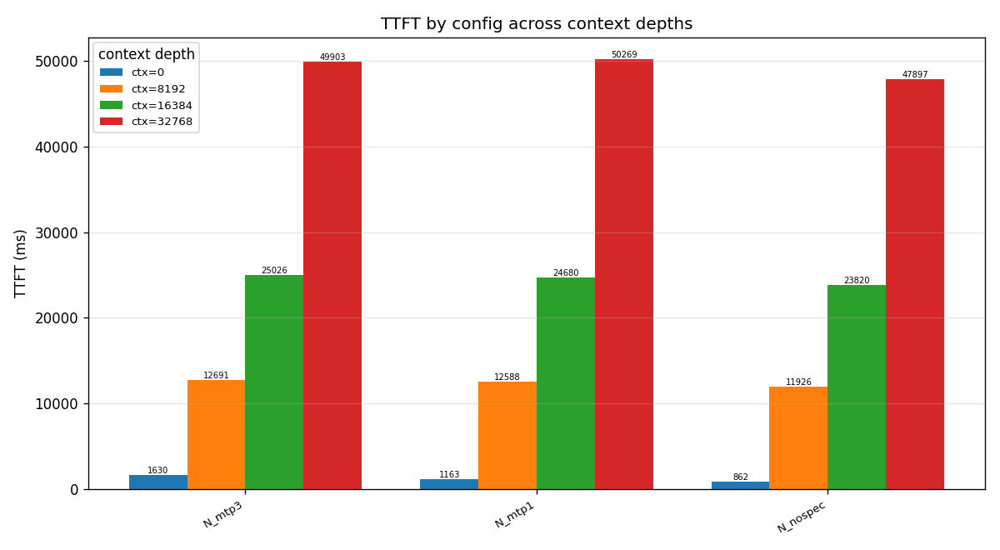

# NVIDIA Nemotron-3-Super-120B-A12B (NVFP4) on DGX Spark (GB10) — performance sweep

Standard benchmark: **llama-benchy** (llama-bench-style). Model kept constant
(Nemotron-3-Super-120B-A12B, NVFP4, `eugr/spark-vllm` image, MTP speculative decoding).
Each config redeployed fresh; context-depth sweep pp=512, tg=256 (`--exact-tg`), runs=2,
latency-mode=generation, 14 depths 0→65536.

_llama-benchy 0.4.0 · single-stream (concurrency=1)_

## Verdict (TL;DR)

1. **Prefill/TTFT-bound, same as Qwen** — TTFT grows ~linearly (1.6s@0 → 25s@16k → 50s@32k); decode is flat vs context. The lever is prefix reuse, not engine knobs.
2. **MTP speculative decoding clearly helps: +49% decode** over no-spec (18.6 vs 12.5 tok/s @ctx0). **MTP n=3 ≥ n=1** across the board (small but consistent), so n=3 is the right default.
3. **Prefix caching works** (3.6× TTFT at 6k), but llama-benchy's cached-phase timing goes null above ~6k here — an async-scheduling / block-streaming measurement artifact, not a deployment failure. So high-depth cache speedup is unmeasured for this stack (expected to be large, like Qwen's).
4. **vs Qwen3.5-122B (sister repo):** Nemotron is **slower on both axes** on this hardware — decode ~16 tok/s (vs Qwen DFlash ~22) and TTFT ~50s@32k (vs ~37s). Its NVFP4 + Marlin prefill path is heavier than Qwen's INT4+DFlash. Nemotron's draw is capability/1M-context, not speed.

## Configs

Same model throughout; each config changes only the MTP draft depth. `n` =
`num_speculative_tokens`; `n0` = speculation off.

| config | what it is | isolates |
|---|---|---|
| `N_mtp3` | **Baseline** — MTP n=3, NVFP4, fp8 KV, Marlin MoE/linear, prefix caching on (the shipped recipe) | reference |
| `N_mtp1` | MTP draft depth **1** | MTP depth effect |
| `N_nospec` | **Speculation off** | what MTP actually buys |

All: `--quantization fp4 --kv-cache-dtype fp8 --mamba-ssm-cache-dtype float16`, Marlin kernels
(`VLLM_TEST_FORCE_FP8_MARLIN=1`), `--max-model-len 262144 --gpu-memory-utilization 0.85`,
FlashInfer attention (auto), `--async-scheduling`. Unlike Qwen/DFlash, MTP uses the built-in
MTP head (no separate drafter) and runs on FlashInfer attention, so **fp8 KV works with
speculation here** (it doesn't on Qwen's DFlash/FLASH_ATTN path).

## Summary — decode tok/s and TTFT by context

| config | dec@0 | dec@4k | dec@16k | dec@32k | ttft@16k(ms) | ttft@32k(ms) |
|---|--:|--:|--:|--:|--:|--:|
| `N_mtp3` | 18.6 | 16.2 | 15.7 | 16.1 | 25026.4 | 49903.3 |
| `N_mtp1` | 18.4 | 15.0 | 14.7 | 14.7 | 24680.2 | 50269.1 |
| `N_nospec` | 12.5 | 11.9 | 11.8 | 11.8 | 23819.9 | 47897.2 |

## Full data

See `dataset.csv` / `dataset.json`. Per-config, per-context rows:

| config | ctx | prefill t/s | decode t/s | peak t/s | TTFT ms |
|---|--:|--:|--:|--:|--:|
| `N_mtp3` | 0 | 426.72 | 18.63 | 26.0 | 1630.0 |
| `N_mtp3` | 512 | 646.29 | 15.27 | 25.0 | 1654.9 |
| `N_mtp3` | 1024 | 615.71 | 14.57 | 23.5 | 2499.4 |
| `N_mtp3` | 2048 | 479.71 | 16.75 | 25.0 | 5048.2 |
| `N_mtp3` | 3072 | 606.6 | 15.68 | 22.5 | 5455.3 |
| `N_mtp3` | 4096 | 621.82 | 16.23 | 25.5 | 6789.6 |
| `N_mtp3` | 6144 | 631.2 | 17.01 | 24.5 | 9769.1 |
| `N_mtp3` | 8192 | 624.73 | 17.34 | 25.0 | 12691.2 |
| `N_mtp3` | 12288 | 618.69 | 15.58 | 22.0 | 18829.8 |
| `N_mtp3` | 16384 | 615.54 | 15.69 | 24.0 | 25026.4 |
| `N_mtp3` | 24576 | 614.1 | 17.48 | 24.5 | 37065.8 |
| `N_mtp3` | 32768 | 601.62 | 16.13 | 25.0 | 49903.3 |
| `N_mtp3` | 49152 | 585.88 | 18.72 | 26.5 | 76150.6 |
| `N_mtp3` | 65536 | 570.37 | 15.98 | 24.5 | 105145.4 |
| `N_mtp1` | 0 | 943.39 | 18.44 | 21.5 | 1163.2 |
| `N_mtp1` | 512 | 888.47 | 14.14 | 17.5 | 1521.6 |
| `N_mtp1` | 1024 | 708.94 | 15.01 | 18.0 | 2368.5 |
| `N_mtp1` | 2048 | 669.63 | 15.04 | 18.0 | 3879.6 |
| `N_mtp1` | 3072 | 660.02 | 14.28 | 17.5 | 5322.7 |
| `N_mtp1` | 4096 | 602.2 | 14.97 | 18.0 | 7483.9 |
| `N_mtp1` | 6144 | 659.08 | 15.1 | 18.0 | 9668.8 |
| `N_mtp1` | 8192 | 644.9 | 15.61 | 18.0 | 12587.9 |
| `N_mtp1` | 12288 | 632.47 | 15.49 | 18.0 | 18571.5 |
| `N_mtp1` | 16384 | 629.46 | 14.65 | 18.0 | 24680.2 |
| `N_mtp1` | 24576 | 618.97 | 15.18 | 18.0 | 36844.7 |
| `N_mtp1` | 32768 | 603.86 | 14.69 | 17.5 | 50269.1 |
| `N_mtp1` | 49152 | 589.16 | 14.83 | 17.5 | 76612.9 |
| `N_mtp1` | 65536 | 574.22 | 15.59 | 19.0 | 104020.2 |
| `N_nospec` | 0 | 765.29 | 12.51 | 14.0 | 862.5 |
| `N_nospec` | 512 | 753.83 | 11.91 | 13.0 | 1501.0 |
| `N_nospec` | 1024 | 673.17 | 11.97 | 13.0 | 2291.3 |
| `N_nospec` | 2048 | 667.94 | 11.97 | 13.0 | 3695.0 |
| `N_nospec` | 3072 | 657.12 | 11.96 | 13.0 | 5212.9 |
| `N_nospec` | 4096 | 661.86 | 11.86 | 13.0 | 6667.9 |
| `N_nospec` | 6144 | 673.11 | 11.91 | 13.0 | 9182.5 |
| `N_nospec` | 8192 | 663.24 | 11.86 | 13.0 | 11926.3 |
| `N_nospec` | 12288 | 651.54 | 11.83 | 12.5 | 18016.3 |
| `N_nospec` | 16384 | 648.02 | 11.82 | 13.0 | 23819.9 |
| `N_nospec` | 24576 | 638.5 | 11.8 | 13.0 | 35720.2 |
| `N_nospec` | 32768 | 629.09 | 11.77 | 13.5 | 47897.2 |
| `N_nospec` | 49152 | 615.38 | 11.7 | 13.0 | 73293.4 |
| `N_nospec` | 65536 | 599.12 | 11.68 | 13.5 | 99740.0 |

## Prefix caching — cold vs cached TTFT (the multi-turn/agent win)

`--enable-prefix-caching` two-step measurement: reuse a cached context vs re-prefill it. This is what a multi-turn agent sees when its prefix is stable.

**N_mtp3**

| context | cold TTFT (ms) | cached TTFT (ms) | speedup |
|--:|--:|--:|--:|
| 0 | 1630 | 1129 | 1.44x |
| 512 | 1655 | 1670 | 0.99x |
| 1024 | 2499 | 2474 | 1.01x |
| 2048 | 5048 | 3976 | 1.27x |
| 3072 | 5455 | 5400 | 1.01x |
| 4096 | 6790 | 6798 | 1.0x |
| 6144 | 9769 | 2709 | 3.61x |

## Graphs

